# Data Products Platform — Architecture Design

**Date:** 2026-02-14
**Status:** Approved
**Author:** Architecture Team

## Context & Constraints

| Dimension | Value |
|---|---|
| Storage | S3 Lakehouse |
| Table format | Apache Iceberg |
| Query engine (primary) | Athena (serverless) |
| Additional engines | Snowflake (external storage), Starburst (Trino) |
| Catalog & FGAC | Lake Formation (column/row-level perms) |
| Enterprise catalog | Central Glue Mesh Catalog + Alation |
| Org model | Medium (6-15 domains), federated governance |
| Consumers | Internal apps, analytics/BI (Tableau + Power BI), external partners |
| API preference | GraphQL |
| IaC | Terraform |
| Jurisdictions | EU, India, Switzerland, US, Monaco |

## Approach

Lake Formation-centric data mesh as the foundation, with targeted elements from a custom platform approach:

- **Lake Formation** as the governance/FGAC control plane, **AppSync** for internal GraphQL
- **Apollo Federation** for the external-facing and app-facing consumption layer
- **Cedar (Verified Permissions)** for policy-as-code governance
- **Tokenisation** for jurisdictional PII separation
- **AWS DataZone rejected** — adds an abstraction layer that conflicts with custom contracts and flexible GraphQL

---

## 1. Data Product Specification & Contract Model

### Data Product Specification

A data product is a versioned, discoverable, governed unit of data with a defined owner, schema contract, SLO, and access policy. Each data product is represented as a specification document stored in the catalog:

```
data-product-spec/
├── manifest.yaml          # Identity, ownership, classification
├── schema/
│   ├── contract.avro      # Output port schema (Avro for Iceberg compat)
│   └── evolution-policy   # BACKWARD, FORWARD, FULL, NONE
├── quality/
│   ├── slo.yaml           # Freshness, completeness, accuracy targets
│   └── expectations.yaml  # Great Expectations / Deequ rules
├── access/
│   ├── policy.cedar       # Cedar access policy
│   └── classification.yaml # PII/PHI/confidential field tags
└── lineage/
    └── upstream.yaml      # Declared dependencies on other data products
```

### Manifest Structure

```yaml
apiVersion: dataproduct/v1
kind: DataProduct
metadata:
  name: customer-360
  domain: customer-intelligence
  owner:
    team: ci-data-engineering
    contact: ci-data-eng@company.com
    escalation: ci-platform-lead@company.com
  tier: gold                    # gold/silver/bronze SLO tiers
  classification: confidential  # public/internal/confidential/restricted
spec:
  description: "Unified customer view combining CRM, transactions, and engagement"
  outputPorts:
    - name: customer_profile
      format: iceberg
      location: s3://lakehouse-curated/customer-intelligence/customer-360/
      catalog: glue:customer_intelligence.customer_profile
      schema: schema/contract.avro
      freshness: PT1H            # ISO 8601 duration — 1 hour
    - name: customer_api
      format: graphql
      endpoint: /data-products/customer-360/graphql
  inputPorts:
    - dataProduct: crm/contacts
    - dataProduct: transactions/orders
    - source: kinesis:clickstream-events
  slo:
    availability: 99.9%
    freshness: PT1H
    completeness: 99.5%
```

### Ownership Model

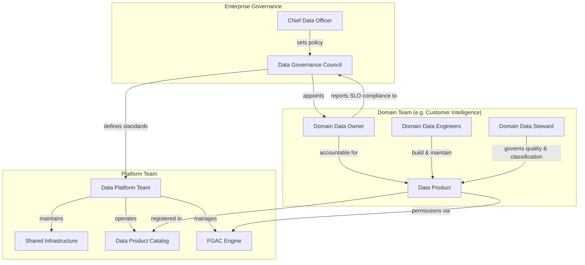

### Schema Contract & Evolution

| Policy | Meaning | When to Use |
|---|---|---|
| **BACKWARD** | New schema can read old data | Default for most products |
| **FORWARD** | Old schema can read new data | When consumers can't update quickly |
| **FULL** | Both backward and forward | Critical shared products (gold tier) |
| **NONE** | Breaking changes allowed | Dev/experimental products only |

Schema contracts are enforced at registration time — the catalog service validates the proposed schema against the evolution policy before a new version is published.

---

## 2. High-Level Architecture

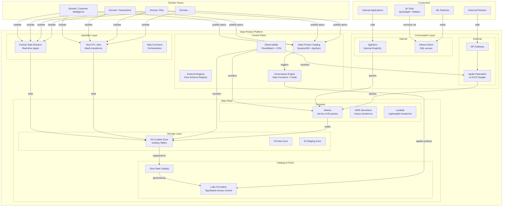

### Layer Responsibilities

| Layer | Purpose | Key Services |
|---|---|---|
| **Control Plane** | Manage data product lifecycle, governance, observability | DynamoDB, AppSync, Step Functions, Cedar, CloudWatch |
| **Data Plane** | Store, catalog, and secure the actual data | S3, Iceberg, Glue Catalog, Lake Formation |
| **Hydration Layer** | Ingest and transform data into data products | Kinesis, Glue ETL, Step Functions |
| **Consumption Layer** | Expose data products to consumers via appropriate interfaces | AppSync (internal GraphQL), Apollo Federation (external GraphQL), Athena (SQL) |

### Data Product Lifecycle Flow

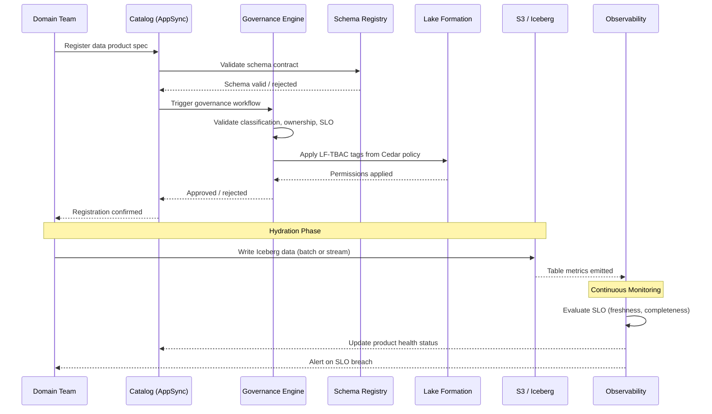

### Network Topology

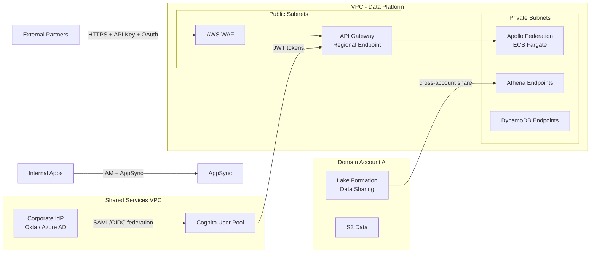

### Cross-Account Model

Each domain gets its own AWS account (or shares accounts within a domain boundary). Data products are shared via Lake Formation cross-account grants, with the platform account acting as the central catalog and governance hub.

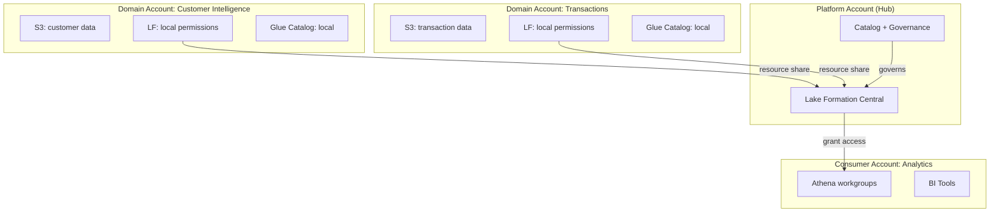

---

## 3. Data Product Catalog & Metadata

### Architecture Choice

| Option Considered | Verdict |
|---|---|
| **DynamoDB + AppSync** (chosen) | Serverless, scales to zero, native GraphQL, single-table design handles hierarchical product specs well, pay-per-request fits medium scale |
| **Aurora PostgreSQL + Apollo** | Relational model is natural for metadata, but introduces cluster management overhead that isn't justified at 6-15 domains |
| **AWS DataZone** | Rejected — too opinionated, poor GraphQL fit |

### DynamoDB Single-Table Design

All catalog entities live in one table with a composite key design:

| Entity | PK | SK | Attributes |
|---|---|---|---|
| Data Product | `DP#customer-360` | `META` | name, domain, owner, tier, classification, status, created, updated |
| Version | `DP#customer-360` | `VER#2024-03-15T10:00:00Z` | version, schema_ref, changelog, status |
| Output Port | `DP#customer-360` | `PORT#customer_profile` | format, location, catalog_ref, freshness_slo |
| Input Port | `DP#customer-360` | `INPUT#crm/contacts` | source_product, source_type |
| SLO | `DP#customer-360` | `SLO#availability` | target, current, breach_count, last_evaluated |
| Access Policy | `DP#customer-360` | `POLICY#default` | cedar_policy_ref, lf_tags, classification |
| Domain | `DOMAIN#customer-intelligence` | `META` | name, owner_team, contact, products_count |
| Subscription | `SUB#analytics-team` | `DP#customer-360` | subscriber, status, granted_ports, approved_by, expires |

**GSI-1 (Domain index):** `GSI1PK = DOMAIN#<domain>`, `GSI1SK = DP#<product>` — list all products in a domain.

**GSI-2 (Status index):** `GSI2PK = STATUS#<status>`, `GSI2SK = DP#<product>` — find all products by lifecycle status.

**GSI-3 (Subscriber index):** `GSI3PK = SUB#<subscriber>`, `GSI3SK = DP#<product>` — list all subscriptions for a consumer.

### AppSync GraphQL Schema (Key Types)

```graphql
type DataProduct {
  id: ID!
  name: String!
  domain: Domain!
  owner: OwnerInfo!
  tier: Tier!
  classification: Classification!
  status: ProductStatus!
  currentVersion: ProductVersion!
  versions: [ProductVersion!]!
  outputPorts: [OutputPort!]!
  inputPorts: [InputPort!]!
  slos: [SLO!]!
  accessPolicy: AccessPolicy!
  subscriptions: [Subscription!]!
  health: HealthStatus!
  createdAt: AWSDateTime!
  updatedAt: AWSDateTime!
}

type OutputPort {
  name: String!
  format: PortFormat!
  location: String!
  catalogRef: String!
  schema: SchemaContract!
  freshnessSLO: String
}

type Subscription {
  subscriber: String!
  dataProduct: DataProduct!
  grantedPorts: [String!]!
  status: SubscriptionStatus!
  approvedBy: String
  expiresAt: AWSDateTime
}

type Query {
  getDataProduct(id: ID!): DataProduct
  listDataProducts(domain: String, tier: Tier, status: ProductStatus): DataProductConnection!
  searchDataProducts(query: String!, filters: SearchFilters): DataProductConnection!
  getSubscription(subscriberId: String!, productId: ID!): Subscription
  listSubscriptions(subscriberId: String): [Subscription!]!
}

type Mutation {
  registerDataProduct(input: RegisterProductInput!): DataProduct!
  publishVersion(productId: ID!, input: PublishVersionInput!): ProductVersion!
  requestSubscription(input: SubscriptionRequestInput!): Subscription!
  approveSubscription(subscriptionId: ID!): Subscription!
  revokeSubscription(subscriptionId: ID!): Subscription!
  updateSLO(productId: ID!, input: UpdateSLOInput!): SLO!
  deprecateDataProduct(productId: ID!, sunset: AWSDateTime!): DataProduct!
}

type Subscription @aws_subscribe(mutations: ["publishVersion", "updateSLO"]) {
  onProductUpdated(domain: String): DataProduct
  onSLOBreach(tier: Tier): SLO
}

enum ProductStatus { DRAFT PUBLISHED DEPRECATED SUNSET }
enum Tier { GOLD SILVER BRONZE }
enum Classification { PUBLIC INTERNAL CONFIDENTIAL RESTRICTED }
enum PortFormat { ICEBERG GRAPHQL }
enum SubscriptionStatus { PENDING APPROVED REVOKED EXPIRED }
```

### Subscription Model

Data access is subscription-based. Consumers request subscriptions to specific output ports, which triggers a governance workflow:

| Product Tier | Classification | Approval |
|---|---|---|
| Bronze | Public / Internal | Auto-approved |
| Silver | Public / Internal | Auto-approved |
| Silver | Confidential | Domain owner approval |
| Gold | Any | Domain owner + governance council approval |
| Any | Restricted | Governance council + CDO approval |

Approved subscriptions result in Lake Formation grants being applied to the subscriber's IAM role. Subscriptions have optional expiry dates and can be revoked.

---

## 4. Fine-Grained Access Control (FGAC)

### FGAC Strategy: Lake Formation TBAC + Cedar Policies

| System | Role | Scope |
|---|---|---|
| **Cedar policies** | Express business intent | Policy authoring, version control, audit |
| **Lake Formation TBAC** | Enforce at query time — column/row/cell filtering on Iceberg tables | Runtime enforcement on Athena, EMR, Redshift Spectrum |
| **AppSync/Apollo resolvers** | Enforce on GraphQL — field-level authorization based on caller identity | Runtime enforcement on API layer |

Cedar is the **policy-of-record**. LF tags and GraphQL resolver rules are **derived** from Cedar policies by the governance engine.

### Tag Taxonomy

| Tag Key | Example Values | Applied To | Purpose |
|---|---|---|---|
| `domain` | `customer-intelligence`, `transactions`, `risk` | Database | Domain ownership boundary |
| `tier` | `gold`, `silver`, `bronze` | Table | SLO tier / governance strictness |
| `classification` | `public`, `internal`, `confidential`, `restricted` | Table, Column | Data sensitivity |
| `pii_type` | `email`, `phone`, `ssn`, `address`, `dob` | Column | PII sub-classification |
| `product` | `customer-360`, `order-history` | Table | Data product identity |
| `environment` | `prod`, `staging`, `dev` | Database | Environment isolation |
| `jurisdiction` | `EU`, `IN`, `CH`, `US`, `MC` | Table, Column | Data residency and regulatory scope |
| `residency_region` | `eu-west-1`, `ap-south-1`, `eu-central-2`, `us-east-1`, `eu-west-3` | Table | AWS region where PII must stay |
| `tokenised` | `true`, `false` | Column | Whether the column contains tokens vs raw PII |
| `erasure_status` | `active`, `erased`, `pending_erasure` | Row-level | GDPR/DPDPA erasure tracking |
| `consent_basis` | `consent`, `contract`, `legitimate_interest`, `legal_obligation` | Table | Lawful basis for processing |
| `cross_border_approved` | `true`, `false` | Table | Whether cross-border transfer has been approved |

### Cedar Policy Model

```cedar
// Gold-tier products require explicit subscription
permit(
  principal in Group::"subscribed-consumers",
  action in [Action::"read", Action::"query"],
  resource
) when {
  resource has tier && resource.tier == "gold" &&
  principal has subscription &&
  principal.subscription.contains(resource.product)
};

// PII columns restricted to PII-trained users
forbid(
  principal,
  action in [Action::"read"],
  resource
) when {
  resource has classification && resource.classification == "confidential" &&
  resource has pii_type &&
  !(principal has pii_certified && principal.pii_certified == true)
};

// External partners only see public columns
forbid(
  principal in Group::"external-partners",
  action in [Action::"read"],
  resource
) when {
  resource has classification && resource.classification != "public"
};
```

### FGAC Across Consumption Paths

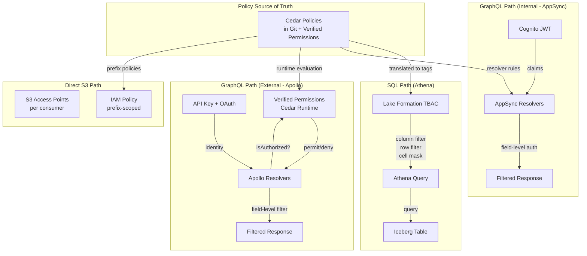

### Column-Level Security Example

| Column | Classification | PII Type | Public | Internal User | PII-Certified User | External Partner |
|---|---|---|---|---|---|---|
| `customer_id` | internal | - | hidden | visible | visible | hidden |
| `name` | confidential | name | hidden | hidden | visible | hidden |
| `email` | confidential | email | hidden | hidden | visible | hidden |
| `segment` | internal | - | hidden | visible | visible | visible |
| `lifetime_value` | internal | - | hidden | visible | visible | hidden |
| `phone` | restricted | phone | hidden | hidden | visible (with approval) | hidden |
| `region` | public | - | visible | visible | visible | visible |

### Row-Level Security

| Scenario | LF Row Filter Expression |
|---|---|
| Regional data residency | `region = 'eu-west-1'` |
| Domain scoping | `domain = 'customer-intelligence'` |
| Partner data isolation | `partner_id = '{caller.partner_id}'` |
| Time-boxed access | `event_date >= '2024-01-01'` |

---

## 4a. Jurisdictional Complexity & Tokenisation

### Jurisdictional Landscape

| Jurisdiction | Regulation | Data Residency Requirement | Cross-Border Transfer | Key Constraint |
|---|---|---|---|---|
| **EU** | GDPR | No hard residency mandate, but practical preference for EU processing | Adequacy decision, SCCs, or BCRs required | Right to erasure, data minimisation, lawful basis |
| **India** | DPDPA 2023 | Critical personal data must stay in India; general PD can transfer with conditions | Government-notified whitelist of countries, or consent + contract | Consent-based processing, data fiduciary obligations |
| **Switzerland** | nFADP (revDSG) | No hard mandate, but Swiss adequacy is separate from EU | Own adequacy list (overlaps with EU), SCCs recognised | Independent from GDPR — separate compliance track |
| **US** | CCPA/CPRA + state patchwork | No federal residency requirement | No transfer restrictions (but sector-specific: HIPAA, GLBA) | Right to opt-out of sale, right to delete, sensitive PI categories |
| **Monaco** | Law No. 1.565 | Processing should occur within Monaco or adequate countries | CCIN (Monaco's DPA) approval for non-adequate transfers | Not an EU member — separate adequacy assessments needed |

### Data Residency Architecture

Core principle: **PII stays in-jurisdiction; tokenised analytical data flows freely.**

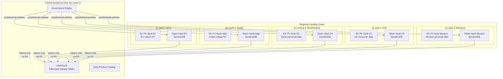

### Token Design

| Aspect | Design Decision |
|---|---|
| **Token format** | Format-preserving: `TOK_<jurisdiction>_<type>_<hash>` e.g. `TOK_EU_EMAIL_a8f3b2c1` |
| **Token scope** | One token per (entity, field, jurisdiction) — same person's email gets different tokens in EU vs India vaults |
| **Token generation** | HMAC-SHA256 with jurisdiction-specific rotating keys stored in KMS |
| **Reversibility** | Only via Token Vault lookup — requires explicit `detokenise` permission |
| **Deterministic** | Yes, within a jurisdiction — same input produces same token, enabling joins on tokenised data |
| **Cross-jurisdiction join** | Via a **global entity ID** (non-PII synthetic key) that links tokens across vaults |

### Tokenisation Flow

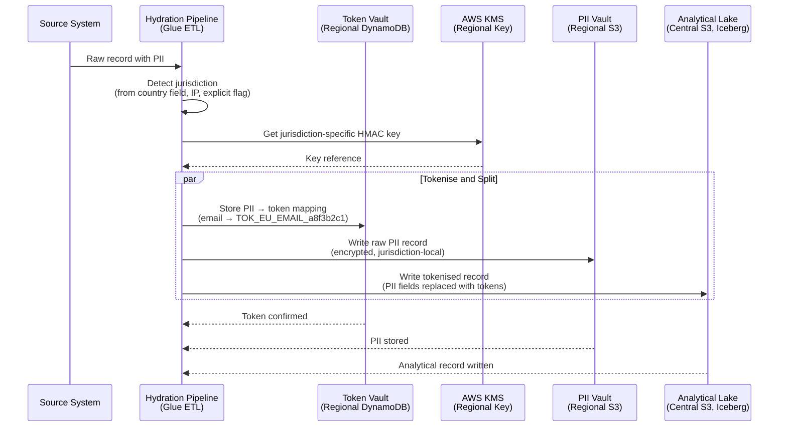

### Detokenisation (Controlled Re-identification)

Detokenisation is a privileged operation, never available by default:

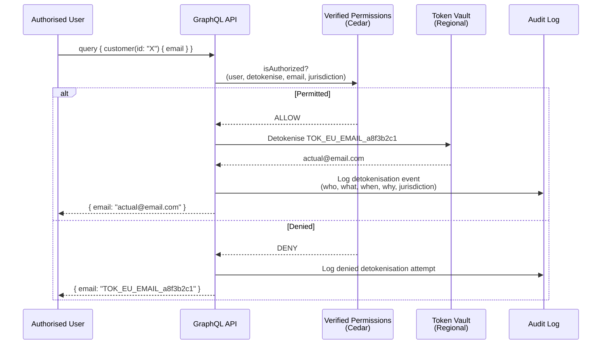

### Jurisdictional Cedar Policies

```cedar
// Indian critical personal data never leaves ap-south-1
forbid(
  principal,
  action in [Action::"detokenise"],
  resource
) when {
  resource has jurisdiction && resource.jurisdiction == "IN" &&
  resource has pii_type && resource.pii_type in ["aadhaar", "pan", "biometric"] &&
  context has caller_region && context.caller_region != "ap-south-1"
};

// EU right to erasure — detokenisation forbidden for erased entities
forbid(
  principal,
  action in [Action::"read", Action::"detokenise"],
  resource
) when {
  resource has erasure_status && resource.erasure_status == "erased"
};

// Monaco data requires CCIN-approved basis
forbid(
  principal,
  action in [Action::"detokenise"],
  resource
) when {
  resource has jurisdiction && resource.jurisdiction == "MC" &&
  !(principal has monaco_approved_basis && principal.monaco_approved_basis == true)
};

// Swiss data — separate from EU, requires Swiss-specific authorisation
forbid(
  principal,
  action in [Action::"detokenise"],
  resource
) when {
  resource has jurisdiction && resource.jurisdiction == "CH" &&
  !(principal has swiss_data_access && principal.swiss_data_access == true)
};

// US CCPA — honour opt-out flags
forbid(
  principal,
  action in [Action::"detokenise", Action::"share"],
  resource
) when {
  resource has jurisdiction && resource.jurisdiction == "US" &&
  resource has ccpa_opt_out && resource.ccpa_opt_out == true &&
  principal in Group::"third-party-processors"
};
```

### Right to Erasure

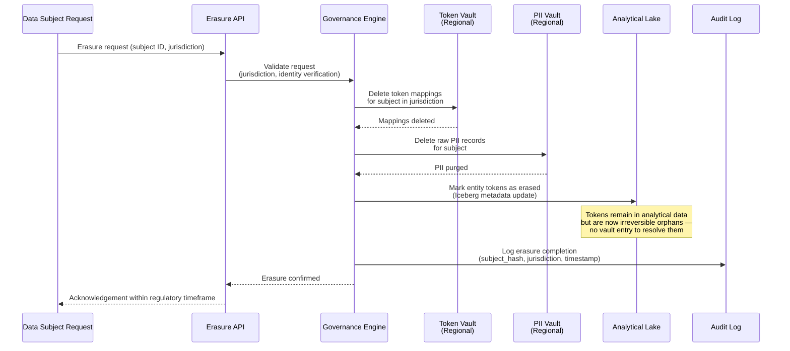

Deleting the vault mapping makes the tokens permanently unresolvable — this constitutes **cryptographic erasure**.

---

## 5. Hydration Layer

### Hydration Patterns

| Pattern | Use Case | Services | Latency |
|---|---|---|---|
| **Batch** | Historical loads, daily/hourly refreshes, large aggregations | Glue ETL → Iceberg | Minutes to hours |
| **Micro-batch** | Near real-time with exactly-once semantics | Kinesis → Glue Streaming → Iceberg | 1-5 minutes |
| **Streaming** | Event-driven, real-time metrics, CDC | Kinesis → Lambda/Flink → Iceberg | Seconds |
| **Federation** | Query-time hydration from external sources, no materialisation | Athena Federated Query | On-demand |

### Hydration Architecture

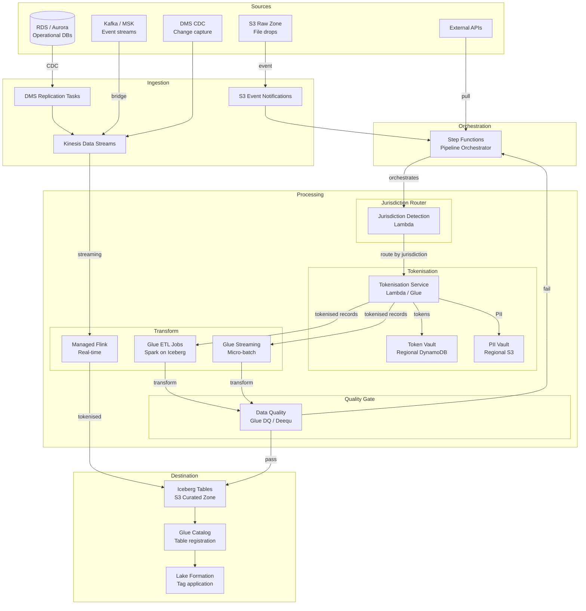

### Pipeline Orchestration

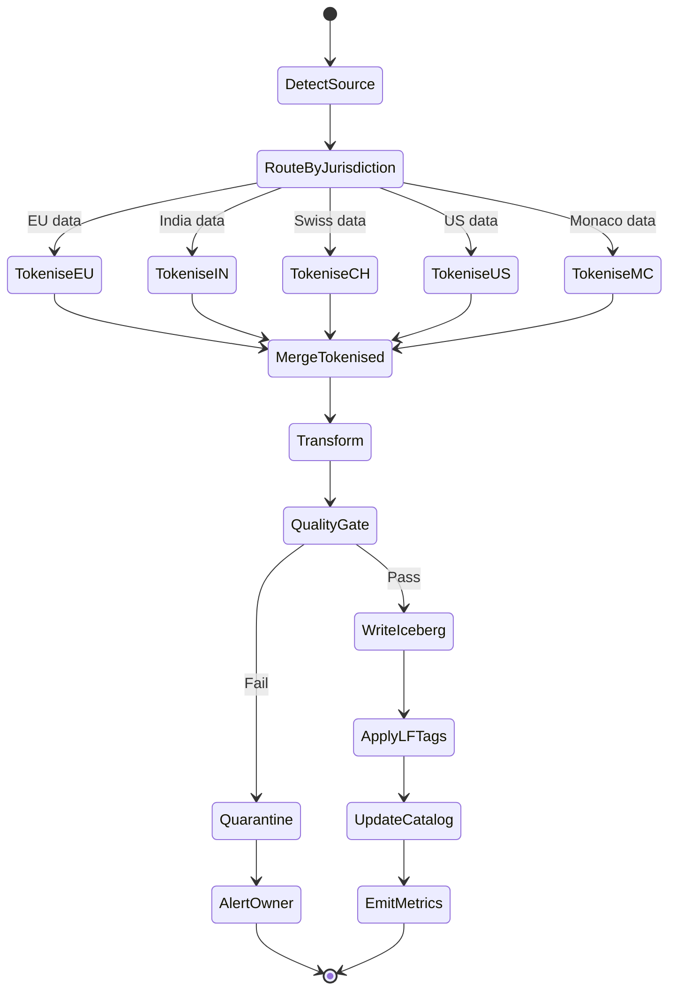

### Jurisdiction Detection

| Priority | Method | Example |
|---|---|---|
| 1 | Explicit field | `jurisdiction: "EU"` in the record |
| 2 | Country code mapping | `country: "DE"` → EU, `country: "IN"` → India |
| 3 | Phone prefix | `+41` → Switzerland, `+377` → Monaco |
| 4 | Source system tagging | DMS source tagged as `jurisdiction=IN` |
| 5 | Default | Configured per pipeline, fail-safe to most restrictive |

Records with ambiguous jurisdiction are routed to a quarantine queue for manual classification.

### Data Quality Gate

```yaml
expectations:
  - name: customer_id_not_null
    type: column_not_null
    column: customer_id
    severity: critical

  - name: email_format_valid
    type: column_regex
    column: email_token
    pattern: "^TOK_[A-Z]{2}_EMAIL_[a-f0-9]{8}$"
    severity: critical

  - name: record_count_drift
    type: table_row_count
    min_delta_pct: -10
    max_delta_pct: 200
    severity: warning

  - name: freshness_check
    type: column_max_age
    column: updated_at
    max_age: PT2H
    severity: warning

  - name: jurisdiction_coverage
    type: column_distinct_values
    column: jurisdiction
    expected: ["EU", "IN", "CH", "US", "MC"]
    severity: warning
```

| Severity | Behaviour |
|---|---|
| **Critical** | Pipeline halts, data quarantined, owner alerted, catalog health → `FAILING` |
| **Warning** | Data written, alert emitted, catalog health → `DEGRADED` |
| **Info** | Metric recorded, no action |

---

## 5a. Catalog Synchronisation & Alation Integration

### Catalog Topology

| Tier | System | Role | Scope |
|---|---|---|---|
| **Domain Catalog** | Glue Data Catalog (per domain account) | Source of truth for domain Iceberg tables | Single domain |
| **Data Product Catalog** | DynamoDB + AppSync | Data product metadata, contracts, SLOs, subscriptions | Platform-wide |
| **Enterprise Mesh Catalog** | Central Glue Catalog + Alation | Cross-enterprise discovery, business glossary, lineage | Enterprise-wide |

Metadata flows upward (domain → platform → enterprise), governance flows downward (enterprise → platform → domain).

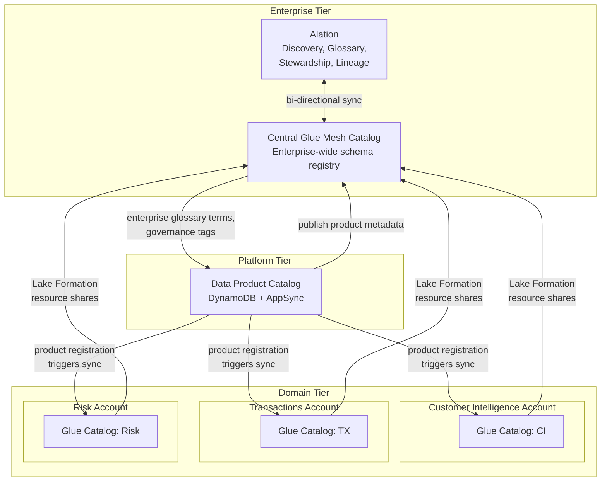

### What Syncs Where

| Metadata Type | Source of Truth | Synced To | Mechanism |
|---|---|---|---|
| **Table schemas & partitions** | Domain Glue Catalog | Central Glue Catalog | LF resource links (automatic) |
| **Product specs, SLOs, contracts** | Data Product Catalog (DynamoDB) | Alation (custom fields) | EventBridge → Lambda → Alation API |
| **Business glossary terms** | Alation | Data Product Catalog, Central Glue (tags) | Alation API → Lambda → DynamoDB + Glue tags |
| **Data classification tags** | Data Product Catalog (Cedar) | Central Glue (LF tags), Alation (custom fields) | Governance engine push |
| **Lineage** | Glue ETL job metadata + product input/output ports | Alation (lineage graph) | Alation Glue connector + custom lineage API |
| **Quality metrics** | Observability layer (CloudWatch) | Alation (quality badges) | Lambda → Alation API |
| **Ownership & stewardship** | Data Product Catalog | Alation (stewardship assignments) | Bi-directional sync via API |

### Alation Custom Fields for Data Products

| Alation Custom Field | Maps From | Type |
|---|---|---|
| `Data Product ID` | Catalog: product ID | String |
| `Domain` | Catalog: domain | Picker |
| `Product Tier` | Catalog: tier | Picker (Gold/Silver/Bronze) |
| `Data Classification` | Catalog: classification | Picker |
| `Freshness SLO` | Catalog: SLO spec | String (ISO 8601) |
| `Current Freshness` | Observability: metric | Rich text (with badge) |
| `Availability SLO` | Catalog: SLO spec | String (percentage) |
| `Current Availability` | Observability: metric | Rich text (with badge) |
| `Schema Contract` | Catalog: evolution policy | Picker |
| `Jurisdictions` | Catalog: jurisdiction tags | Multi-picker |
| `Subscription Status` | Catalog: subscription model | Picker |
| `Owner Team` | Catalog: owner | Object reference |
| `GraphQL Endpoint` | Catalog: output port | URL |

### Conflict Resolution

| Conflict Type | Resolution Rule |
|---|---|
| Schema difference between domain Glue and central Glue | Domain Glue wins — resource links are authoritative |
| Ownership changed in Alation vs Data Product Catalog | Alation wins — stewardship is Alation's domain |
| Business glossary term applied in Alation but missing from Glue tags | Alation term synced to Glue tags via governance engine |
| Classification changed in Cedar policy vs Alation | Cedar policy wins — classification is a security control |
| SLO metrics differ between observability and Alation | Observability wins — Alation is a consumer of metrics |

---

## 6. Consumption Layer

### Consumption Paths

| Consumer | Interface | Auth Mechanism | FGAC Enforcement | Latency Profile |
|---|---|---|---|---|
| Internal applications | AppSync (GraphQL) | IAM / Cognito JWT | AppSync resolvers + Verified Permissions | Sub-second (cached) to seconds |
| External partners | API Gateway → Apollo Federation (GraphQL) | API Key + OAuth2 | Apollo resolvers + Verified Permissions | Seconds |
| BI tools (QuickSight, Tableau) | Athena (SQL) | IAM / Lake Formation | LF-TBAC column/row filters | Seconds to minutes |
| Data engineers / analysts | Athena (SQL) | IAM / Lake Formation | LF-TBAC column/row filters | Seconds to minutes |
| ML pipelines | Athena / S3 direct | IAM | LF-TBAC + S3 Access Points | Varies |
| Other data products | Iceberg table read (Glue ETL / Flink) | IAM cross-account | LF resource shares | Batch |

### Consumption Architecture

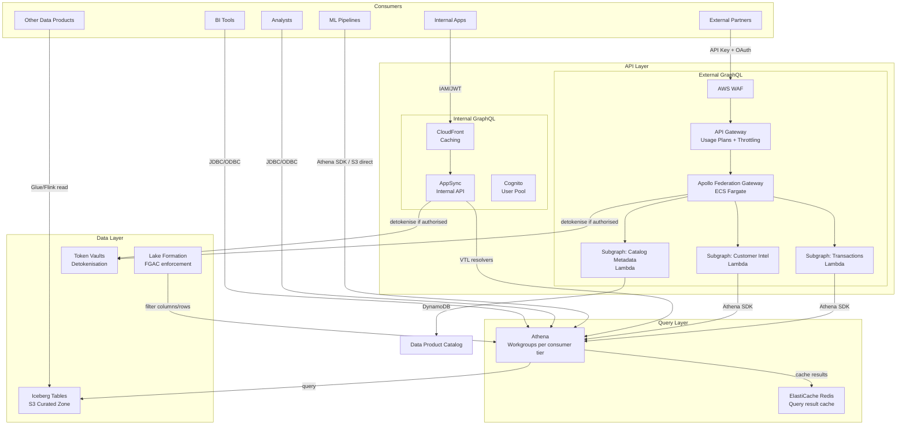

### Caching Strategy by Tier

| Tier | CloudFront TTL | ElastiCache TTL | Rationale |
|---|---|---|---|
| Gold | No cache | 60 seconds | High freshness SLO, critical data |
| Silver | 60 seconds | 5 minutes | Balanced freshness vs cost |
| Bronze | 5 minutes | 15 minutes | Cost-optimised, relaxed freshness |

### Apollo Federation

Each domain owns a subgraph while presenting a unified schema to external partners:

```graphql
# Customer Intelligence subgraph
type Customer @key(fields: "id") {
  id: ID!
  segment: String
  lifetimeValue: Float
  region: String
  email: String
  jurisdiction: String
}

# Transactions subgraph — extends Customer
extend type Customer @key(fields: "id") {
  orders: [Order!]!
  totalSpend: Float
  lastOrderDate: String
}

type Order @key(fields: "orderId") {
  orderId: ID!
  customer: Customer!
  amount: Float
  currency: String
  status: OrderStatus
  createdAt: String
}
```

### External Partner Controls

| Control | Mechanism |
|---|---|
| Can only query subscribed products | Verified Permissions checks subscription status |
| Can only see their own data | Row-level filter: `partner_id = '{caller.partner_id}'` |
| Never see raw PII | Detokenisation permission denied for external group |
| Rate limited | API Gateway usage plans per partner |
| Geo-restricted | WAF geo-match rules aligned to partner jurisdiction |
| Schema introspection disabled | Apollo Gateway config: `introspection: false` in production |

### Athena Workgroups

| Workgroup | Consumer | Query Limit | Scan Limit | Cost Allocation |
|---|---|---|---|---|
| `wg-bi-gold` | BI dashboards on gold products | 50 concurrent | 10 TB/query | Charged to platform |
| `wg-analyst` | Data analysts (ad-hoc) | 10 concurrent | 1 TB/query | Charged to analyst's domain |
| `wg-ml-pipeline` | ML training jobs | 20 concurrent | 50 TB/query | Charged to ML team |
| `wg-external` | External (via Apollo subgraph) | 5 concurrent | 100 GB/query | Charged to partner |

---

## 6a. BI Integration — Tableau & Power BI

### BI Connectivity

| Dimension | Tableau | Power BI |
|---|---|---|
| **Connection method** | Athena JDBC/ODBC connector (native) | Athena ODBC via Power BI Gateway, or DirectQuery |
| **Authentication** | IAM role via SAML federation | Service principal → IAM role via Power BI Gateway |
| **Lake Formation FGAC** | Fully supported | Fully supported |
| **Recommendation** | Live for gold, extract for silver/bronze | DirectQuery for gold, Import for silver/bronze |

### BI Architecture

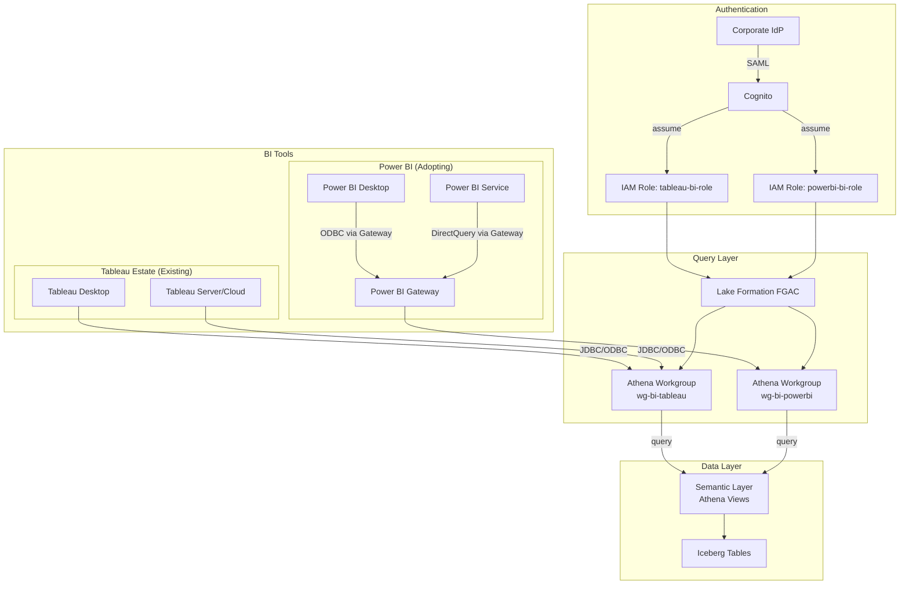

### Semantic Layer

Athena views provide a stable, governed interface. Both Tableau and Power BI query the same views, ensuring consistency during migration.

- Registered as output ports on data products (format: `athena_view`)
- Governed by the same LF-TBAC
- Named using business glossary terms from Alation
- Versioned — breaking changes go through schema contract process

### BI Workgroups

| Workgroup | Tool | Mode | Concurrent Queries | Scan Limit | Result Reuse |
|---|---|---|---|---|---|
| `wg-bi-tableau-live` | Tableau | Live connection | 30 | 5 TB | 15 min |
| `wg-bi-tableau-extract` | Tableau | Extract refresh | 10 | 20 TB | Disabled |
| `wg-bi-powerbi-dq` | Power BI | DirectQuery | 30 | 5 TB | 15 min |
| `wg-bi-powerbi-import` | Power BI | Import refresh | 10 | 20 TB | Disabled |

---

## 6b. Jurisdictional Detokenisation for BI

### Core Rule

Detokenisation in BI is subject to the same Cedar policy enforcement as every other consumption path. A user must satisfy ALL of:

1. **Identity** — PII-certified and subscribed to the product
2. **Jurisdiction** — their session originates from an approved region for that data's jurisdiction
3. **Purpose** — the detokenisation has a declared lawful basis

If any condition fails, the field renders as the token value.

### Enforcement via Athena UDF

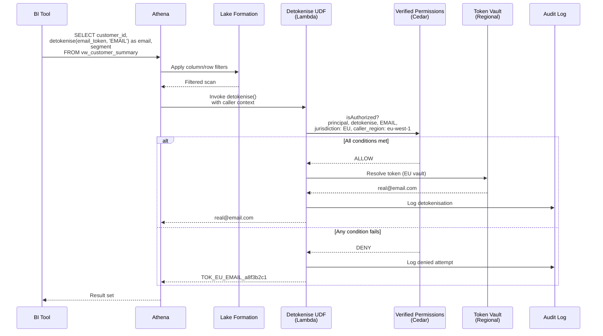

### Jurisdiction-to-Region Enforcement Map

| Data Jurisdiction | Permitted Detokenisation Regions | Token Vault Region |
|---|---|---|
| **EU** | `eu-west-1`, `eu-central-1` | `eu-west-1` |
| **India** | `ap-south-1` | `ap-south-1` |
| **Switzerland** | `eu-central-2` (Zurich) | `eu-central-2` |
| **US** | `us-east-1`, `us-west-2` | `us-east-1` |
| **Monaco** | `eu-west-3` (Paris) | `eu-west-3` |

### Regional UDF Deployment

The detokenisation Lambda UDF is deployed in each permitted region. The token prefix (`TOK_EU_`, `TOK_IN_`, etc.) tells the UDF which regional vault to call. The UDF verifies that its own execution region matches the jurisdiction's permitted region.

### Mixed-Jurisdiction Result Sets

A single query can span multiple jurisdictions. The UDF handles this row-by-row:

| Row | `jurisdiction` | `email_token` | Caller in `eu-west-1` | Caller in `us-east-1` |
|---|---|---|---|---|
| 1 | EU | `TOK_EU_EMAIL_a8f3b2c1` | `real@eu.com` | `TOK_EU_EMAIL_a8f3b2c1` |
| 2 | IN | `TOK_IN_EMAIL_c3d4e5f6` | `TOK_IN_EMAIL_c3d4e5f6` | `TOK_IN_EMAIL_c3d4e5f6` |
| 3 | US | `TOK_US_EMAIL_d7e8f9a0` | `TOK_US_EMAIL_d7e8f9a0` | `real@us.com` |
| 4 | CH | `TOK_CH_EMAIL_e1f2a3b4` | `TOK_CH_EMAIL_e1f2a3b4` | `TOK_CH_EMAIL_e1f2a3b4` |

---

## 7. Compute

### Compute Taxonomy

| Compute Type | Workload | Service | Scaling Model |
|---|---|---|---|
| **Query** | Ad-hoc SQL, BI dashboards, GraphQL resolution | Athena | Serverless, per-query |
| **Batch transform** | Hydration ETL, compaction, large joins | Glue ETL (Spark) | Serverless, DPU-based |
| **Streaming** | Real-time ingest, CDC processing | Managed Flink | Auto-scaled KPU |
| **Lightweight transform** | Tokenisation, small enrichments, UDFs | Lambda | Serverless, per-invocation |
| **Heavy analytics** | Complex ML feature engineering, large aggregations | EMR Serverless | Auto-scaled, Spark |
| **API compute** | Apollo Federation gateway | ECS Fargate | Task-based auto-scaling |
| **Orchestration** | Pipeline coordination, governance workflows | Step Functions | Serverless, per-transition |

### Compute Selection Decision Tree

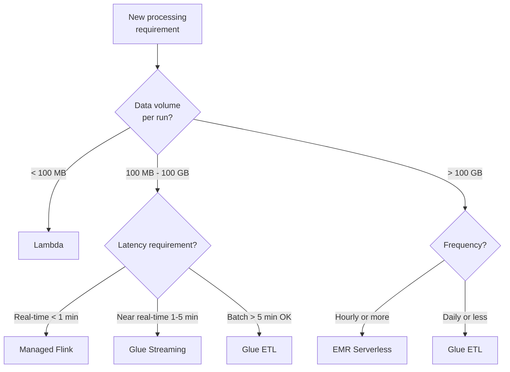

### Glue ETL Configuration per Product Tier

| Tier | Worker Type | Max DPUs | Job Timeout | Retry Strategy |
|---|---|---|---|---|
| Gold | G.2X | 100 | 4 hours | 3 retries, exponential backoff |
| Silver | G.1X | 50 | 2 hours | 2 retries |
| Bronze | G.1X | 20 | 1 hour | 1 retry |

### Compute Quotas per Domain

| Resource | Per-Domain Quota | Platform Reserve |
|---|---|---|
| Athena concurrent queries | 20 | 50 (shared BI + platform) |
| Glue max concurrent DPUs | 150 | 100 (maintenance jobs) |
| Lambda concurrent executions | 200 | 100 (platform functions) |
| EMR Serverless max vCPUs | 200 | 100 (backfill reserve) |
| Step Functions concurrent executions | 50 | 20 (governance workflows) |

### Cost Allocation Tags

| Tag Key | Example Values | Purpose |
|---|---|---|
| `domain` | `customer-intelligence` | Chargeback to domain team |
| `data-product` | `customer-360` | Per-product cost tracking |
| `compute-tier` | `hydration`, `serving`, `maintenance` | Cost by lifecycle stage |
| `environment` | `prod`, `staging` | Environment isolation |
| `consumer` | `bi-tableau`, `partner-acme` | Consumption cost attribution |

---

## 7a. Multi-Engine Compute — Snowflake & Starburst

### Engine Comparison

| Dimension | Athena | Snowflake (External Storage) | Starburst |
|---|---|---|---|
| **Deployment** | Serverless (AWS-managed) | SaaS (Snowflake-managed) | EKS or Starburst Galaxy (SaaS) |
| **Cost model** | Per TB scanned | Credit-based | Node-based (EKS) or credit-based (Galaxy) |
| **Idle cost** | Zero | Zero (if auto-suspends) | Node cost (EKS) or zero (Galaxy) |
| **Iceberg support** | Native, first-class | External Catalog (read) | Native, first-class |
| **Federation** | Limited | Limited | Excellent (core strength) |
| **FGAC mechanism** | Lake Formation (native) | RBAC + DDM (translated from Cedar) | BIAC + masking (translated from Cedar) |
| **Detokenisation** | Lambda UDF (direct) | External Function via API GW | Lambda UDF (direct) |
| **Concurrency** | Moderate | High (multi-cluster warehouse) | High (auto-scaled workers) |
| **Catalog source** | Domain Glue Catalog (direct) | Central Glue Mesh Catalog | Domain or Central Glue Catalog |
| **Data location** | S3 (in-place) | S3 (in-place, via External Volume) | S3 (in-place) |
| **Write capability** | Yes | Read-only (external catalog mode) | Yes |

### Engine Selection Decision Tree

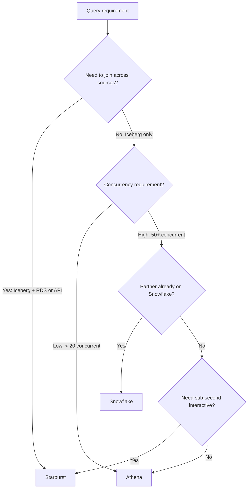

### FGAC Consistency Across Engines

Cedar remains the single source of truth. The governance engine translates Cedar policies into engine-native controls:

| Cedar Policy Concept | Lake Formation | Snowflake | Starburst |
|---|---|---|---|
| Column hide | LF column filter | Dynamic Data Masking → NULL | Column mask → NULL |
| Column mask (tokenised) | LF cell-level security | DDM policy returning token | Column mask function |
| Row filter | LF row filter expression | Row Access Policy | Row filter predicate |
| Role-based access | LF tag-based grant | Snowflake role (SCIM-synced) | Starburst role (IdP group) |
| Detokenisation | Lambda UDF (direct) | External Function → API GW → Lambda | Lambda UDF (direct) |

### Cross-Engine Consistency Verification

Automated test suite runs standardised queries using test identities across all three engines. Any discrepancy in returned columns, rows, or masking triggers a P1 alert.

---

## 7b. Snowflake — Enterprise External Storage Integration

Snowflake connects via external storage integrations against the **central enterprise Glue mesh catalog**, not domain-level catalogs.

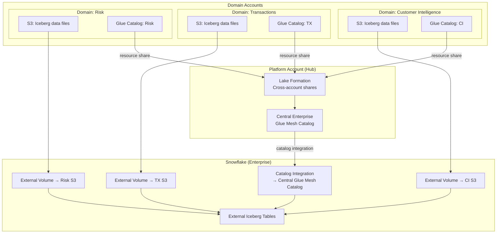

### IAM Trust Chain

- Snowflake gets **read-only** access to curated zone prefixes only
- IAM role scoped per S3 prefix, not per bucket
- ExternalId condition prevents confused deputy attacks
- Role lives in the **platform account** — platform team controls access

### Snowflake Object Hierarchy

```
Snowflake Account (Enterprise)
└── Database: DATA_PRODUCTS
    ├── Schema: CUSTOMER_INTELLIGENCE
    │   ├── External Iceberg Table: CUSTOMER_PROFILE
    │   └── Secure View: VW_CUSTOMER_SUMMARY (masking applied)
    ├── Schema: TRANSACTIONS
    │   ├── External Iceberg Table: ORDERS
    │   └── Secure View: VW_ORDER_METRICS (masking applied)
    └── Schema: RISK
        ├── External Iceberg Table: EXPOSURE
        └── Secure View: VW_RISK_SUMMARY (masking applied)
```

External Iceberg Tables are raw external objects. **Secure Views** sit on top with Dynamic Data Masking and Row Access Policies applied.

### Detokenisation in Snowflake

Snowflake uses External Functions via API Gateway. A routing UDF directs detokenisation calls to the correct regional endpoint based on the token prefix (`TOK_EU_`, `TOK_IN_`, etc.). The Lambda behind each regional endpoint performs the same Cedar evaluation as Athena and Starburst paths.

### Metadata Refresh

| Method | Latency | Use Case |
|---|---|---|
| **Auto-refresh** | Minutes | Silver/Bronze products |
| **SNS notification** | Seconds | Gold products with tight freshness SLOs |
| **Manual refresh** | On-demand | Ad-hoc |

---

## 8. Observability

### SLO Framework

| SLO Type | Metric | Measurement Source | Evaluation Frequency |
|---|---|---|---|
| **Freshness** | Time since last Iceberg commit | Iceberg snapshot metadata | Every 5 minutes |
| **Completeness** | Record count vs expected | Glue DQ + Iceberg metadata | Per hydration run |
| **Accuracy** | Quality expectation pass rate | Glue DQ / Deequ results | Per hydration run |
| **Availability** | % successful queries vs total | Query engine logs | Rolling 5-minute window |
| **Latency** | P50/P95/P99 query response time | Query engine logs + GraphQL resolver timing | Rolling 5-minute window |
| **Schema stability** | Days since last breaking change | Glue Schema Registry | On schema change |

### Data Product Health Score

| Health Score | Meaning | Criteria |
|---|---|---|
| **100** | All SLOs met, no recent breaches | All SLOs healthy for 7+ days |
| **75-99** | All SLOs currently met, recent breach history | All SLOs healthy, but breach in last 7 days |
| **50-74** | One or more SLOs degraded | Warning-level SLO breach active |
| **25-49** | Critical SLO breached | One critical SLO in breach |
| **0-24** | Multiple critical SLOs breached | Multiple critical breaches or product down |

Health score is shown in the Data Product Catalog, synced to Alation as a quality badge, and available via the GraphQL API.

### Alert Routing

| Severity | Trigger | Routing | Auto-Remediation |
|---|---|---|---|
| **P1** | Gold + Freshness/Availability breach | PagerDuty page: domain + platform on-call | Restart pipeline / increase concurrency |
| **P2** | Gold + Completeness/Accuracy breach | PagerDuty alert: domain on-call | - |
| **P3** | Silver + any breach | Slack: #data-quality, domain channel | - |
| **P4** | Bronze + any breach | Daily email digest to domain owner | - |

### Observability as a Data Product

All observability data is itself published as a gold-tier data product with output ports for: SLO evaluations, query logs, detokenisation audit, policy sync status, and cost attribution. Domain teams can subscribe to build their own dashboards.

---

## 9. Audit

### Audit Principles

| Principle | Implementation |
|---|---|
| **Immutable** | Iceberg tables with write-once S3 Object Lock |
| **Complete** | Every data access, policy decision, lifecycle event captured |
| **Tamper-evident** | Daily Merkle hash, stored in a separate account |
| **Jurisdictionally aware** | Audit records stored per residency rules |
| **Queryable** | Audit data is a data product, queryable via Athena |
| **Retained** | Per regulation (GDPR: processing + 1yr, DPDPA: 3yr, US: 7yr) |

### Audit Event Taxonomy

- **Data Access Events:** Query executed, detokenisation attempt, data download/export
- **Governance Events:** Policy change, subscription lifecycle, classification change
- **Data Lifecycle Events:** Product published, hydration run, erasure executed
- **Security Events:** Authentication, authorisation denial, anomaly detected

### Audit Record Schema

Common envelope with event-specific detail:

```yaml
audit_event:
  event_id: "uuid-v4"
  event_type: "DATA_ACCESS | DETOKENISATION | POLICY_CHANGE | ERASURE | ..."
  timestamp: "2024-03-15T14:23:01.456Z"
  actor:
    identity: "arn:aws:iam::123:role/analyst-eu"
    user: "jane.smith@company.com"
    idp_groups: ["pii-certified", "customer-intelligence"]
    source_ip: "10.0.1.42"
    user_agent: "Tableau/2024.1"
  resource:
    data_product: "customer-360"
    domain: "customer-intelligence"
    output_port: "customer_profile"
    tier: "gold"
    classification: "confidential"
    jurisdiction: "EU"
  location:
    engine: "athena | snowflake | starburst | appsync | apollo"
    region: "eu-west-1"
    workgroup: "wg-bi-tableau-live"
  decision:
    result: "ALLOW | DENY"
    policy_matched: "pii-certified-jurisdiction-match"
    cedar_policy_version: "v2024-03-14"
  detail: { ... }
```

### Jurisdictional Audit Residency

| Audit Event Jurisdiction | Storage Region | Retention |
|---|---|---|
| EU | `eu-west-1` | Duration of processing + 1 year |
| India | `ap-south-1` | 3 years (DPDPA) |
| Switzerland | `eu-central-2` | 10 years (nFADP + sector) |
| US | `us-east-1` | 7 years (SOX/GLBA default) |
| Monaco | `eu-west-3` | 5 years (CCIN guidelines) |
| Non-jurisdictional | `eu-west-1` | 3 years |

### Immutability

- **S3 Object Lock (GOVERNANCE mode)** prevents deletion/overwrite
- **Daily Merkle hash chain** in separate account provides tamper evidence
- **Weekly verification** recomputes hashes and compares

### Compliance Reports

| Report | Regulation | Frequency |
|---|---|---|
| Data Subject Access Report | GDPR Art 15, DPDPA | On-demand |
| Detokenisation Log | All jurisdictions | Monthly |
| Erasure Compliance | GDPR Art 17, DPDPA | On-demand |
| Cross-border Transfer Log | GDPR Ch V, DPDPA | Quarterly |
| Policy Change History | Internal governance | Monthly |
| FGAC Consistency Report | Internal governance | Weekly |

### Anomaly Detection Rules

| Rule | Threshold |
|---|---|
| Volume spike | 10x normal query count in 1-hour window |
| Off-hours access | Query outside user's normal working hours |
| New jurisdiction access | User accessing jurisdiction they've never queried |
| Bulk detokenisation | >100 detokenisations in single session |
| Denied access spike | >5 denials in 10 minutes from same user |

---

## 10. Security

### Defence in Depth

| Layer | Controls |
|---|---|
| **Perimeter** | AWS WAF (OWASP rules, geo-blocking, rate limiting), Shield Advanced, Route 53 DNSSEC |
| **Network** | VPC isolation, private subnets for all compute, VPC endpoints for all AWS services, NACLs, security groups |
| **Identity & Access** | Corporate IdP federation, Cognito, IAM roles per-service per-domain, Lake Formation FGAC, Verified Permissions |
| **Data Protection** | KMS encryption per-domain per-jurisdiction, S3 SSE-KMS, TLS 1.3 everywhere, tokenisation |
| **Detection & Response** | GuardDuty, Security Hub, Macie (PII discovery), CloudTrail, custom anomaly detection |

### Encryption Strategy

| Key Type | Scope | Purpose |
|---|---|---|
| Per-domain KMS keys | Domain data at rest | Domain isolation |
| Per-jurisdiction token vault keys | Token vault encryption | Jurisdictional isolation |
| Per-jurisdiction HMAC keys | Token generation | Deterministic tokenisation |
| Platform keys | Audit, catalog | Platform data protection |

Key management rules:
- One KMS key per domain for data at rest
- One KMS key per jurisdiction for token vaults
- Separate HMAC keys per jurisdiction for token generation
- Annual key rotation enabled on all keys
- Key policy restricts decrypt to specific IAM roles
- Audit key managed by security team, not platform team

### IAM Role Strategy

| Role | Trust | Permissions |
|---|---|---|
| `dp-platform-admin` | Platform team IdP group | Full platform management, no data access |
| `dp-domain-engineer-<domain>` | Domain team IdP group | Glue, S3, Step Functions within domain |
| `dp-domain-owner-<domain>` | Domain owner IdP group | Catalog mutations for owned products |
| `dp-consumer-analyst` | Analyst IdP group | Athena query, LF-scoped data access |
| `dp-consumer-pii-certified` | PII-certified IdP group | Above + detokenisation UDF invocation |
| `dp-bi-tableau` | Tableau Server service account | Athena workgroup `wg-bi-tableau-*` |
| `dp-bi-powerbi` | Power BI Gateway service account | Athena workgroup `wg-bi-powerbi-*` |
| `dp-external-partner-<id>` | Cognito M2M OAuth | API Gateway invocation, scoped to partner products |
| `dp-snowflake-reader` | Snowflake storage integration principal | S3 GetObject on curated prefixes (read-only) |
| `dp-apollo-gateway` | ECS task role | Athena, DynamoDB, Verified Permissions, Token Vaults |
| `dp-governance-engine` | Step Functions execution role | LF admin, Verified Permissions admin, Snowflake API, Starburst API |

All roles use permission boundaries to cap maximum privileges.

### S3 Bucket Security

- Block Public Access: enabled (account-level and bucket-level)
- Bucket Policy: deny non-SSL, deny non-VPC-endpoint
- Encryption: SSE-KMS with domain-specific key
- Versioning: enabled on all curated and audit buckets
- Object Lock: GOVERNANCE mode on audit buckets
- Access Logging: to dedicated logging bucket
- Lifecycle: Intelligent-Tiering on curated, Glacier on audit after retention

### Threat Detection

- **GuardDuty**: S3 protection, EKS protection (Starburst), Lambda protection
- **Macie**: Scheduled PII scans on curated zone — detects unintentional PII leakage
- **Security Hub**: Aggregates findings via ASFF
- **IAM Access Analyzer**: Detects external access
- **Custom anomaly detection**: Rules from audit layer

Automated response via Step Functions: isolate (revoke IAM sessions), block (WAF IP deny), alert (PagerDuty P1), snapshot (preserve evidence).

### Security Review Cadence

| Review | Frequency | Owner |
|---|---|---|
| IAM role policy review | Quarterly | Platform + Security |
| KMS key access audit | Quarterly | Security |
| Cedar policy review | Monthly | Governance council |
| Macie findings review | Weekly | Platform team |
| GuardDuty findings triage | Daily (automated) | Security team |
| Penetration test (external API) | Annually | External auditor |
| Cross-engine FGAC consistency | Weekly (automated) | Platform team |

---

## 11. Governance

### Governance Model: Federated with Central Standards

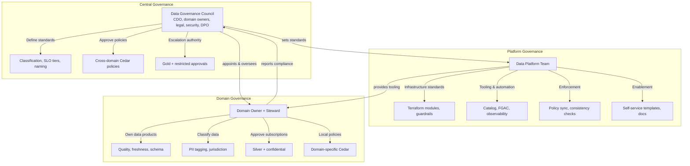

### Data Product Lifecycle

```mermaid
stateDiagram-v2
    [*] --> DRAFT: Domain engineer creates
    DRAFT --> IN_REVIEW: Submit for review
    IN_REVIEW --> DRAFT: Reviewer requests changes
    IN_REVIEW --> PUBLISHED: Approved
    PUBLISHED --> PUBLISHED: New version published
    PUBLISHED --> DEPRECATED: Owner initiates sunset
    DEPRECATED --> SUNSET: Sunset date reached + all subscribers migrated
    SUNSET --> [*]: Data archived/deleted
```

### Lifecycle Approval Matrix

| Transition | Bronze | Silver | Gold |
|---|---|---|---|
| DRAFT → IN_REVIEW | Automated validation | Automated validation | Automated validation |
| IN_REVIEW → PUBLISHED | Auto-approved | Domain owner approval | Governance council approval |
| Schema evolution (BACKWARD) | Auto-approved | Domain owner notified | Domain owner approval |
| Schema evolution (BREAKING) | Domain owner approval | Governance council approval | Governance council + CDO |
| PUBLISHED → DEPRECATED | Domain owner | Domain owner + subscriber notification | Governance council + all subscriber acknowledgement |
| Subscription (public/internal) | Auto-approved | Auto-approved | Domain owner approval |
| Subscription (confidential) | Domain owner | Domain owner + steward | Governance council |
| Subscription (restricted) | Governance council + CDO | Governance council + CDO | Governance council + CDO + DPO |

### Policy-as-Code CI/CD

Cedar policies managed in Git with full CI/CD:
1. Policy author writes Cedar, opens PR
2. CI: syntax validation, test suite, impact analysis, dry-run translation
3. Approval: domain owner (domain policy) or governance council (cross-domain)
4. CD: deploy to Verified Permissions, translate + sync to LF/Snowflake/Starburst, consistency check
5. Auto-rollback on consistency failure

### Data Product Maturity Model

| Level | Name | Criteria |
|---|---|---|
| **L1** | Managed | Manifest, owner, output port, schema defined |
| **L2** | Governed | Classification, Cedar policy, LF tags, SLOs declared |
| **L3** | Quality-assured | DQ expectations defined and passing, freshness SLO met >95% |
| **L4** | Operationalised | Observability complete, alerting configured, runbook documented |
| **L5** | Optimised | Cost-optimised, multi-engine FGAC verified, Alation curated, consumer satisfaction tracked |

**Minimum maturity for publication:**
- Bronze: L1 (Managed)
- Silver: L2 (Governed)
- Gold: L3 (Quality-assured), L4 within 90 days

### Governance Cadences

| Meeting | Frequency | Attendees |
|---|---|---|
| Governance council | Monthly | CDO, domain owners, DPO, security, platform |
| Domain review | Bi-weekly | Domain owner, steward, engineers |
| Platform standup | Weekly | Platform engineering team |
| Incident review | Per incident (within 5 days) | Relevant domain + platform + security |
| Quarterly business review | Quarterly | CDO, domain owners, executive sponsors |

### Self-Service Operations

| Operation | Self-Service? | Mechanism |
|---|---|---|
| Register data product (DRAFT) | Yes | `mutation registerDataProduct` |
| Submit for review | Yes | `mutation submitForReview` |
| Publish version (BACKWARD) | Yes (bronze/silver) | `mutation publishVersion` |
| Request subscription | Yes | `mutation requestSubscription` |
| View product health/SLOs | Yes | `query getDataProduct { health, slos }` |
| Update quality expectations | Yes | `mutation updateQualityExpectations` |
| Classify a column | Yes | `mutation updateClassification` |
| Create domain Cedar policy | Yes | Git PR to `cedar-policies/<domain>/` |
| View audit events (own products) | Yes | Athena on `wg-audit-domain` |
| View cost attribution | Yes | `query getCostReport(domain)` |

### Deprecation & Sunset

- Grace periods: Gold 6 months, Silver 3 months, Bronze 1 month
- All active subscribers notified at deprecation
- Monthly reminders until sunset date
- Cannot sunset while subscribers remain — extend or escalate to governance council
- On sunset: revoke all grants, archive data to Glacier Deep Archive
